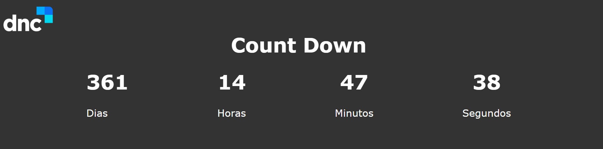

	

	<h1>Contagem regressiva</h1>

### O que é? 🤔
Site desenvolvido para realizar e expor uma contagem regressiva a partir de uma data inserida no JavaScript.

### Quais tecnologias foram usadas? 💻
- HTML5
- CSS3
- Javascript

### Está online? 📡
SIM! Basta [clicar aqui](https://countdown-dnc.netlify.app/) para visualizar o site que está hospedado nos servidores da Netlify.

by Murillo Couto 
[GitHub](https://github.com/MurilloCouto)
